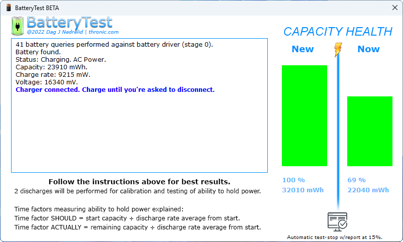
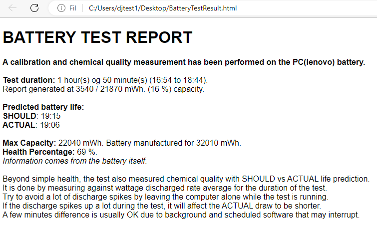

## BatteryTest | Battery testing for laptops

  

**Calibrates and tests the battery of a laptop.**

It's a 2x discharge stage process, and will naturally take a while on a healthy battery.  

» Start the program, charge, discharge until you hear a honk sound, charge and discharge again.  
Program will inform about progress and a report can be saved in html format to desktop at any time.  

During the process, the health will become calibrated by the battery itself (green bars to the right). The program will
also measure "chemical quality", in the sense that it will predict lifetime based on average current draw and measure
it against real capacity and actual lifetime. Bad cell chemical quality and/or damage may discharge faster (loose
mWh as heat or otherwise) than what makes sense and this test is made to reflect and diagnose it. Consider some
margin here, but not too much. A few minutes is normal. A lot is not.  

  

Avoid intermittent usage of the computer while testing. Artificial CPU load is active during discharge to speed up the
process while keeping a stable discharge rate.
